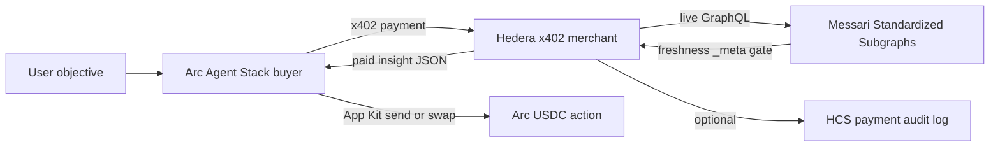

# ETHOnline 2026 — Max Prize Plan

**Deadline:** Sunday, September 13, 2026 at 12:00pm EDT  
**Partners (pick 3):** The Graph · Hedera · Arc  
**Project:** MeteredSignal — x402-metered Graph intelligence for Arc agents

---

## Goal

Maximize prize EV with one shippable project that qualifies under all three partners (and multiple tracks per partner).

**Realistic target:** $4–8k  
**Optimistic ceiling:** $10k+

---

## Why these 3 partners

Selecting a partner counts as **1 of 3**, but you are eligible for **all tracks under that partner**.

| Partner | Best shot | Why |
|---------|-----------|-----|
| Hedera | AI & Agentic Payments — $2,000 × up to 3 teams | Highest hit-rate big prize; brief asks for a live x402 service via Blocky402 |
| The Graph | AI From Scratch + Composable ($5k pools each) | Lisbon winners: standardized schemas, freshness gates, agents that act |
| Arc | Agentic Economy $3.5k + Launch $3.5k | Same Agent Stack / USDC / nanopayments story; mainnet bonus by Sept 30 |

**Do not pick as third:** 1inch / ENS / World — weaker overlap with the x402 agent narrative.

---

## Product: MeteredSignal

**One sentence:** An AI agent buys live multi-protocol DeFi risk/liquidity intelligence (Messari Standardized Subgraphs) via **x402**, settles the paywall on **Hedera (Blocky402)**, and the buyer agent holds/spends **USDC on Arc** through Circle Agent Stack / nanopayments.

### Why judges like this

- **Graph (Lisbon pattern):** one query → N protocols; reject stale `_meta`; agent decides, does not dump JSON
- **Hedera:** Blocky402 testnet + `@x402/hedera` + official x402 PoC
- **Arc:** Agent Stack wallets + nanopayments + App Kits for USDC

### Starter kits

- Hedera: https://github.com/hedera-dev/x402-inference-pay-per-request-poc
- Arc nanopayments: https://github.com/circlefin/arc-nanopayments
- Arc Agent Stack: https://github.com/circlefin/agent-stack-starter-kits
- Blocky402 testnet: `https://api.testnet.blocky402.com` (`hedera:testnet`)

---

## Tracks to claim

### Must qualify

1. **Hedera — AI & Agentic Payments** — live x402 service on Hedera testnet via Blocky402; agent completes ≥1 paid request; ≤5 min video
2. **Graph — Best AI (From Scratch)** — agent uses live Studio Graph data and reasons (risk / go-no-go), not a raw dump
3. **Arc — Best Agentic Economy** — Agent Stack wallet + USDC nanopayments / x402 spend with decision logic tied to Graph signals

### Also claim in submission writeup (free extra shots)

4. **Graph — Composable / Standardized** — same query template across ≥2 Messari-standardized deployments; show protocol registry
5. **Arc — Launch on Arc Testnet & Push to Mainnet** — deploy buyer + Arc pieces to testnet now; document mainnet readiness for Sept 30 unlock

### Skip in the next 24h

- Hedera Tokenization (ATS)
- Hedera Harness
- Continuity-only prizes (unless already registered Continuity)

---

## 24-hour build schedule

### Hour 0–2 — Scaffold

- [ ] Fork/compose Hedera x402 PoC (merchant) + Arc Agent Stack / nanopayments (buyer)
- [ ] Fund Hedera testnet (HBAR) + Arc testnet USDC / Circle agent wallet
- [ ] Create Graph Subgraph Studio API key
- [ ] Verify Blocky402: `curl https://api.testnet.blocky402.com/supported`

### Hour 2–8 — Merchant (Hedera x402 + Graph)

- [ ] Replace inference payload with Graph-backed endpoints, e.g.:
  - `GET /v1/wallet-risk?address=`
  - `GET /v1/lending-compare`
- [ ] Use Messari Standardized Subgraphs — one query shape, ≥2 protocols
- [ ] Enforce freshness: require `_meta.block.number`; pin deployment IDs; return `unavailable` if stale
- [ ] Metered per-call pricing (not flat-only)
- [ ] Optional: append settlement tx id to an HCS topic (audit trail extra points)

### Hour 8–14 — Buyer (Arc Agent Stack)

- [ ] Agent takes a natural-language goal (“Is this wallet safe to lend against?”)
- [ ] Discovers / pays the Hedera x402 endpoint (honest, demoable payment path)
- [ ] Uses returned Graph evidence in the decision
- [ ] On GO: small USDC App Kit send/swap on Arc Testnet
- [ ] Show wallet policy / spend limit (Agent Stack guardrails)

### Hour 14–18 — Product surface

- [ ] Minimal Next.js UI: paste address → agent run log → payment receipts → decision
- [ ] Architecture diagram in README
- [ ] Public GitHub with clear “how each sponsor is load-bearing”

### Hour 18–22 — Demo + submit

- [ ] Record ≤4–5 min video (script below)
- [ ] Submit partners: **The Graph, Hedera, Arc**
- [ ] Name bounties explicitly: Hedera Agentic Payments, Graph AI + Composable, Arc Agentic + Launch
- [ ] Fill partner feedback fields honestly

### After submit → Sept 30

- [ ] Keep Arc deployment mainnet-ready for the **$2,500 mainnet unlock** on Arc Agentic / Launch

---

## Demo video script (≤5 min)

1. Agent starts on Arc with a USDC budget
2. Hits paywalled Graph intelligence → 402 → pays on Hedera (Blocky402)
3. Shows multi-protocol Graph response + freshness check failing, then succeeding
4. Agent decides and executes an Arc USDC action
5. Show HashScan + Arc explorer receipts

---

## Qualification checklist

- [ ] Live Graph provider data (Studio key) — no mocks
- [ ] ≥2 standardized protocol deployments, one query pattern
- [ ] Real Hedera x402 settle through Blocky402
- [ ] Real Arc Agent Stack + USDC path
- [ ] Public repo + architecture diagram + demo video
- [ ] Partner feedback fields completed

---

## What not to build

- Pure chat wrapper over one subgraph
- Tokenization ATS + agents mashup (too heavy for remaining time)
- Continuity-only tracks without a registered Continuity project
- Custom Substreams pipelines until the core demo path works
